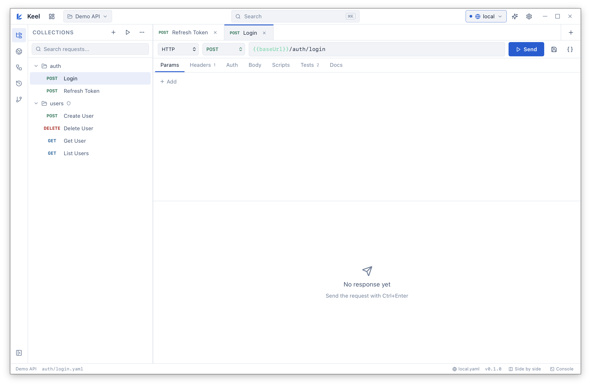
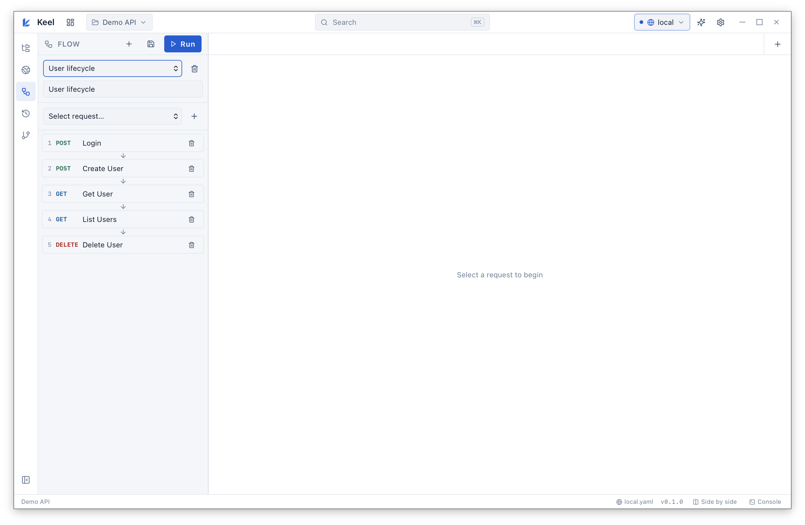

<p align="center">
  
</p>
<p align="center">
  <a href="https://github.com/aharoldk/keel/actions/workflows/ci.yml"></a>
  <a href="https://github.com/aharoldk/keel/actions/workflows/release.yml"></a>
</p>

---

# Keel

A desktop API client. The collection is a folder of YAML files in a Git repository. There is no account and no cloud workspace. The folder is the project, and Git is how it is shared. The core workflow works offline.

Open a folder. Each request is one YAML file. Edit it, send it, write a test, commit.

<p align="center">
  
</p>
<p align="center">
  
</p>

## Features

**Requests.** Methods, query params, headers, and eight body types including GraphQL and file uploads. Redirects, timeouts, proxies, a custom CA, client certificates, and a cookie jar.

**Auth.** Bearer, basic, API key, digest (retries on a 401 challenge), and OAuth2 — client credentials, password, and authorization code with PKCE. Tokens live in memory and refresh when they expire. They are not written to disk.

**Shared config.** A `folder.yaml` passes auth, headers, scripts, and variables to every request inside it. Variables resolve in order: workspace, environment, collection, folders, request, then the session, plus a few builtins. Each variable has a default that is committed and a current value that stays local (`.keel/env-values.yaml`, or the OS keychain for secrets). The current value wins; otherwise the default is used.

**Scripts.** Pre-request and post-response scripts expose `keel`, `req`, and `res`, plus `test()` and a chai-style `expect()`. The Tests tab is separate: one assertion per row, not code.

**Collection runs.** Stream one result at a time, pause between requests, stop on the first failure, or jump with `keel.setNextRequest()`.

**Flows.** A flow is a saved sequence of requests, stored as its own YAML file under `flows/`. Steps run in order. Each step stops the flow on failure unless you set it to continue. Import and export a flow as a file.

**CLI.** `keel-cli` runs the same files without the GUI and prints a JSON or JUnit-style report.

**Import and export.** Import cURL, OpenAPI 3, and Postman v2.1. Export OpenAPI 3. Generate curl, fetch, axios, Python, HTTPie, Go, Java, and Node.

**Git.** Status, stage, unstage, commit, log, per-file diffs, branches, pull, and push. A filesystem watcher picks up edits made outside the app.

The on-disk format is parsed by a library, so it is not tied to this app. Secrets go to the OS keychain — not into git, history, exports, or scripts.

## Build

You need Rust 1.77 or newer, Node 20 or newer, and the [Tauri 2 system dependencies](https://tauri.app/start/prerequisites/) (on Linux, `webkit2gtk-4.1` and `libgtk-3-dev` among them).

```bash
npm install
npm run install:all
npm run dev
```

Then open `examples/demo-workspace`. `auth/login.yaml` is set up to chain into a token.

```bash
npm run build:app            # bundles land in src-tauri/target/release/bundle/
cd src-tauri && cargo test --features cli
```

The Tauri CLI looks for `src-tauri/` in the working directory. While developing, the CLI binary is `src-tauri/target/debug/keel-cli`.

## Command line

```bash
cd src-tauri && cargo build --release --bin keel-cli --features cli
target/release/keel-cli list
target/release/keel-cli run auth/login.yaml --env local
target/release/keel-cli run users/ -r --bail --output report.json --format json
target/release/keel-cli run users/ --data rows.csv
target/release/keel-cli import curl "curl https://api.x/y -H 'a: b'" --folder misc
target/release/keel-cli import openapi ./spec.yaml --folder api
target/release/keel-cli import postman ./collection.json --folder api
```

`0` means every test passed, `1` means something failed, `2` means the arguments or the path were wrong.

# Contribute

Code contributions are welcome. Please open pull requests against the `main` branch.

# License

[MIT](LICENSE). Keel is early and independent — it is not affiliated with any other API client.
